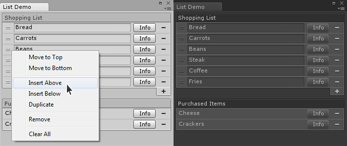
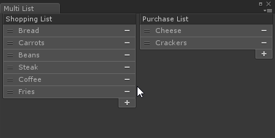

# unity3d-reorderable-list

List control for Unity allowing editor developers to add reorderable list controls to
their GUIs. Supports generic lists and serialized property arrays, though additional
collection types can be supported by implementing `Rotorz.Games.Collections.IReorderableListAdaptor`.


```sh
$ npm install --save rotorz/unity3d-reorderable-list
```

This package is compatible with [unity3d-package-syncer](https://github.com/rotorz/unity3d-package-syncer).




## Features

- Drag and drop reordering!
- Automatically scrolls if inside a scroll view whilst reordering.
- Easily customized using flags.
- Adaptors for `IList<T>` and `SerializedProperty`.
- Subscribe to add/remove item events.
- Supports mixed item heights.
- Disable drag and/or removal on per-item basis.
- Drop insertion (for use with `UnityEditor.DragAndDrop`).
- Styles can be overridden on per-list basis if desired.
- Subclass list control to override context menu.
- Add drop-down to add menu (or instead of add menu).
- Helper functionality to build element adder menus.


## Preview (showing drop insertion feature)




## Installation

The **unity3d-reorderable-list** library is designed to be installed into Unity projects
using the **npm** package manager and then synchronized into the "Assets" directory using
the **unity3d-package-syncer** utility. For more information regarding this workflow refer
to the [unity3d-package-syncer](https://github.com/rotorz/unity3d-package-syncer)
repository.

Alternatively you can download the contents of this repository and add directly into your
project, but you would also need to download the sources of other packages that this
package is dependant upon. Refer to the `packages.json` file to see these.


## A couple of examples!

### Serialized array of strings

```csharp
private SerializedProperty wishlistProperty;
private SerializedProperty pointsProperty;

private void OnEnable()
{
    this.wishlistProperty = this.serializedObject.FindProperty("wishlist");
    this.pointsProperty = this.serializedObject.FindProperty("points");
}

public override void OnInspectorGUI()
{
    this.serializedObject.Update();

    ReorderableListGUI.Title("Wishlist");
    ReorderableListGUI.ListField(this.wishlistProperty);

    ReorderableListGUI.Title("Points");
    ReorderableListGUI.ListField(this.pointsProperty, ReorderableListFlags.ShowIndices);

    this.serializedObject.ApplyModifiedProperties();
}
```


### List of strings

```csharp
private List<string> yourList = new List<string>();

private void OnGUI()
{
    ReorderableListGUI.ListField(this.yourList, this.CustomListItem, this.DrawEmpty);
}

private string CustomListItem(Rect position, string itemValue)
{
    // Text fields do not like null values!
    if (itemValue == null) {
        itemValue = "";
    }
    return EditorGUI.TextField(position, itemValue);
}

private void DrawEmpty()
{
    GUILayout.Label("No items in list.", EditorStyles.miniLabel);
}
```


### More examples

Refer to the `docs/examples` directory of this repository for further examples!


## Contribution Agreement

This project is licensed under the MIT license (see LICENSE). To be in the best
position to enforce these licenses the copyright status of this project needs to
be as simple as possible. To achieve this the following terms and conditions
must be met:

- All contributed content (including but not limited to source code, text,
  image, videos, bug reports, suggestions, ideas, etc.) must be the
  contributors own work.

- The contributor disclaims all copyright and accepts that their contributed
  content will be released to the public domain.

- The act of submitting a contribution indicates that the contributor agrees
  with this agreement. This includes (but is not limited to) pull requests, issues,
  tickets, e-mails, newsgroups, blogs, forums, etc.
