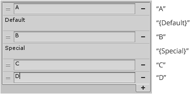

# Custom list adaptor

This example demonstrates how to implement a custom list adaptor which can contain caption
items which cannot be dragged or removed. List items can however be dragged around the
stationary caption items.



Since in this example we are working with a straightforward list of strings it makes sense
to subclass `Rotorz.Games.Collections.GenericListAdaptor<T>`.

A simple naming convention will be assumed to differentiate between regular entries and
captions. String entries which are enclosed between curly brackets will be presented
differently and cannot be reordered or removed using the list control interface. A simple
function can be created to test whether a list entry is a caption like `IsCaption` below.

```csharp
using Rotorz.Games.Collections;
using System.Collections.Generic;
using UnityEditor;

public class SpecialAdaptor : GenericListAdaptor<string>
{
    public SpecialAdaptor(List<string> list, ReorderableListControl.ItemDrawer<string> itemDrawer, float itemHeight)
        : base(list, itemDrawer, itemHeight)
    {
    }


    public override void DrawItem(Rect position, int index)
    {
        string item = this[index];
        if (IsCaption(item)) {
            GUI.Label(position, item.Substring(1, item.Length - 2));
        }
        else {
            base.DrawItem(position, index);
        }
    }

    public override bool CanDrag(int index)
    {
        return !this.IsCaption(this[index]);
    }
    public override bool CanRemove(int index)
    {
        return !this.IsCaption(this[index]);
    }

    public override float GetItemHeight(int index)
    {
        return this.IsCaption(this[index]) ? 28 : this.fixedItemHeight;
    }

    private bool IsCaption(string item)
    {
        return item != null && item.Length > 0
            && item[0] == '{' && item[item.Length - 1] == '}';
    }

}
```

Our custom adaptor must then be instantiated before it can be used; this instance can be
cached if desired. The adaptor instance can then be passed to `ReorderableListGUI.ListField`
or even a custom list control using `IReorderableListAdaptor`.

```csharp
var adaptor = new SpecialAdaptor(list, itemDrawer, 22);
ReorderableListGUI.ListField(adaptor);
```
